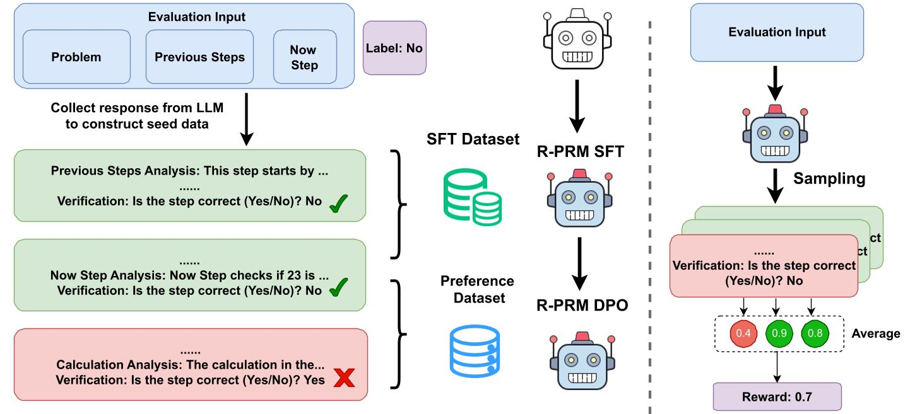
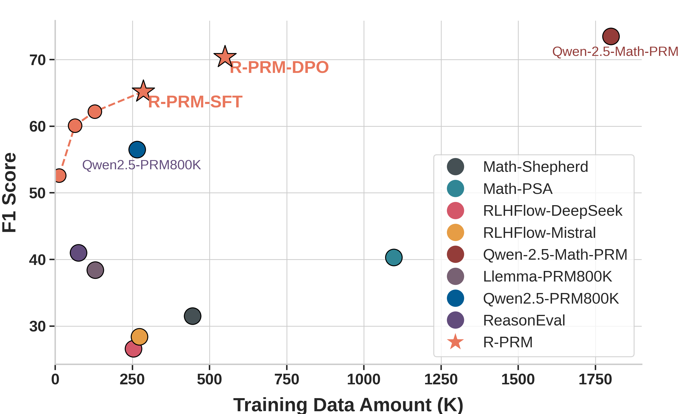
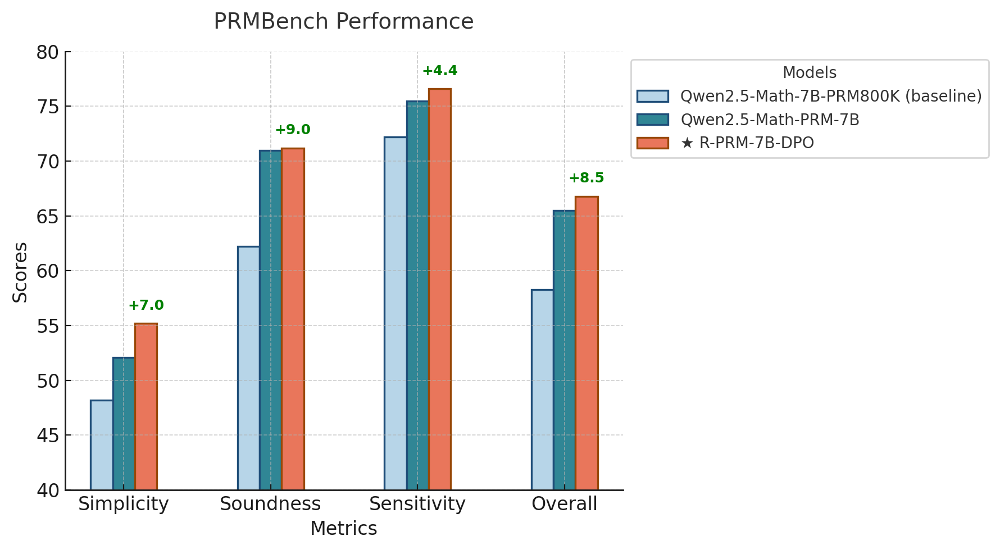
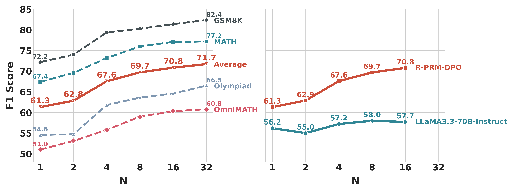

# R-PRM: Reasoning-Driven Process Reward Modeling

<p align="center">
  <a href="https://arxiv.org/abs/2503.21295"> 📃 Paper</a> | 
  <a href="https://shesj-note.notion.site/R-PRM-Reasoning-Driven-Process-Reward-Modeling-9543fb238b0d48338dd44c60999ffd9b"> 📝 Blog</a> | 
  <a href="https://github.com/NJUNLP/R-PRM"> ⚙️ Code</a> | 
  <a href="https://huggingface.co/kevinpro/R-PRM-7B-DPO"> 🤖 Model</a> | 
  <a href="https://huggingface.co/datasets/kevinpro/R-PRM"> 🤗 Dataset</a> | 
  <a href="https://ricardokevins.github.io/"> 📭 Contact</a> 
</p>

## Overview

Process Reward Models (PRMs) evaluate the reasoning process and provide guidance to policy models, which have the potential to further enhance the reasoning capabilities of LLMs. However, current PRMs are limited by their performance.

We propose **Reasoning-Driven Process Reward Modeling (R-PRM)**, a novel approach that enhances LLMs’ ability to evaluate mathematical reasoning step-by-step. Our Framework consists of three parts: supervised cold-start, further meta-optimization in a self-evolving style, and finally inference-time-scaling.

- 🚀  Our Method achieves impressive performance with great **efficiency**. When using the same data scale, our approach outperforms Qwen2.5-Math-7B-PRM800K by a margin of **8.7** in F1 Score on ProcessBench. With the help of DPO that requires no additional annotated data, our PRM achieves comparable performance to Qwen2.5-Math-PRM using only **~15%** of their data volume.
- ⭐ We validated the effectiveness of R-PRM in **self-improving** through preference optimization (Meta-Optimization) and **inference-time-scaling**. Our performance surpassed that of Llama3.3-70B used for synthetic cold-start data, confirming that our method achieves more than simple distillation of the teacher model
- *📈*  Our model excels at fine-grained evaluation, achieving the best performance among open-source PRMs on PRMBench with fine-grained error category labels. Additionally, under the guidance of our model, the policy model attained the highest average accuracy across six mathematical reasoning datasets using both Best-of-N and Guided Search methods.



## 🏆 Experiment Results

### 🧪 **Data Efficiency**

R-PRM demonstrates exceptional data efficiency under varying training scales:

- With just **12.8k** training samples, R-PRM reaches **F1 = 52.6**, already surpassing most open-source PRMs.
- R-PRM achieves **+3.6** F1 over Qwen2.5-Math-7B-PRM800K when trained on just **64k** samples (vs. Qwen's **265k**), and extends this lead to **+8.7** F1 when both are trained on comparable data volumes.
- Notably, despite using only **~15%** of the data, R-PRM’s performance is already comparable to Qwen2.5-Math-PRM, which was trained on a much larger **1.8M** LLM-filtered dataset.



### 📊 **ProcessBench**

 Our reasoning-driven framework improves over Qwen2.5-Math-7B-PRM800K by **+8.7 F1 (SFT)** and **+13.9 F1 (DPO)**, demonstrating its powerful evaluation capability.

| **Model**          | **GSM8K**        | **MATH**         | **OLYMPIAD**     | **OMNIMATH**     | **Avg. F1**      |
| ------------------------ | ---------------------- | ---------------------- | ---------------------- | ---------------------- | ---------------------- |
| Qwen2.5-Math-7B-PRM800K  | 68.2                   | 62.6                   | 50.7                   | 44.3                   | 56.5                   |
| ⭐**R-PRM-7B-SFT** | 77.2 (**+9.0**)  | 71.6 (**+9.0**)  | 59.6 (**+8.9**)  | 52.3 (**+8.0**)  | 65.2 (**+8.7**)  |
| ⭐**R-PRM-7B-DPO** | 80.7 (**+12.5**) | 76.9 (**+14.3**) | 63.8 (**+13.1**) | 60.1 (**+15.8**) | 70.4 (**+13.9**) |
| Math-Shepherd-7B         | 47.9                   | 29.5                   | 24.8                   | 23.8                   | 31.5                   |
| Skywork-PRM-7B           | 70.8                   | 53.6                   | 22.9                   | 21.0                   | 42.1                   |
| Qwen2.5-Math-PRM-7B      | 82.4                   | 77.6                   | 67.5                   | 66.3                   | 73.5                   |
| Llama-3.3-70B-Instruct   | 82.3                   | 59.0                   | 46.3                   | 41.9                   | 57.4                   |
| GPT-4o                   | 79.2                   | 63.6                   | 51.4                   | 53.5                   | 61.9                   |
| o1-mini                  | 93.2                   | 88.9                   | 87.2                   | 82.4                   | 87.9                   |

### 🧠 **PRMBench**

 R-PRM achieves **+8.5 F1 (DPO)** over Qwen2.5-Math-7B-PRM800K
 📌 Excels in **soundness**, **sensitivity**, and **multi-dimensional error analysis**.


### 🔁 **Guide Search Strategy**

 By guiding reasoning step-by-step, R-PRM surpasses Pass@1 by **+8.4 points**, outperforming both **majority voting** and previous PRM-guided methods.

| **Setting / Model** | **AIME24** | **AMC23** | **MATH** | **Olympiad** | **College** | **Minerva** | **Avg.** |
| ------------------------- | ---------------- | --------------- | -------------- | ------------------ | ----------------- | ----------------- | -------------- |
| pass@1                    | 11.2             | 47.8            | 73.0           | 38.0               | 38.6              | 37.2              | 41.0           |
| major@8                   | 20.0             | 57.5            | 79.6           | 47.0               | 41.5              | 42.7              | 48.0           |
| pass@8 (upper bound)      | 33.3             | 82.5            | 88.8           | 58.5               | 47.5              | 57.7              | 61.4           |
| Math-Shepherd-7B          | 13.3             | 52.5            | 74.6           | 38.5               | 36.5              | 41.2              | 42.8           |
| Skywork-PRM-7B            | 10.0             | 57.5            | 77.8           | 41.5               | 39.0              | 43.4              | 44.9           |
| Qwen2.5-Math-7B-PRM800K   | **23.3**   | 45.0            | 78.2           | 42.0               | 35.5              | 38.6              | 43.8           |
| Qwen2.5-Math-PRM-7B       | 16.7             | 60.0            | **81.0** | 43.5               | 39.0              | 40.4              | 46.8           |
| ⭐**R-PRM-7B-DPO**  | 16.7             | **70.0**  | 80.0           | **46.5**     | 39.5              | **43.4**    | **49.4** |

### 🚀 **Inference-Time Scaling**

 Evaluation performance improves consistently as more reasoning trajectories are sampled at inference.
 → From **62.8 F1 (2 samples)** to **67.6 F1 (4 samples)** on ProcessBench.

R-PRM-DPO scales significantly better than LLaMA-3.3-70B-Instruct, with the F1 gap widening from **+5.1 (N=1)** to **+13.1 (N=16)**, highlighting its robust multi-path aggregation capability.

This showcases R-PRM’s ability to deliver **robust, ensemble-style judgment** through multi-path reasoning.



## 🛠️ Training & Evaluation

### 🔧 Training Pipeline

Our training consists of two key stages:

1. **Supervised Fine-Tuning (SFT)** We prompt stronger LLMs with PRM800K samples to construct seed data with detailed step-level analyses and correctness judgments. The model is then trained to generate both reasoning critiques and binary decisions.
2. **Direct Preference Optimization (DPO)** We sample multiple evaluation trajectories and construct preference pairs based on agreement with ground-truth labels. DPO encourages the model to generate consistent and accurate evaluations without requiring additional annotations.

### 📦 Dataset & Scale

- **SFT Training Data**: ~289K samples generated via prompting LLaMA3.3-70B-Instruct
- **DPO Preference Pairs**: ~269K pairs constructed from sampled trajectories
- **Validation Set**: 20K held-out samples for early stopping

### ⚙️ Model & Hyperparameters

- **Base Model**: [Qwen2.5-Math-7B-Instruct](https://huggingface.co/Qwen/Qwen2.5-Math-7B-Instruct)
- **Batch Size**: 128
- **Epochs**: 1
- **Learning Rates**:
  - SFT: `5e-6`
  - DPO: `5e-7`
- **Inference Trajectories**: Default `K=10` per step

### 🧪 Evaluation Protocol

We evaluate the reward model across three main tasks:

- **🔍 ProcessBench**
  Step-level reasoning evaluation with F1 score.
  📄 *Script*: `src/scripts/examples/eval-ProcessBench.sh`
- **🧠 PRMBench**
  Multi-dimensional evaluation across Simplicity, Soundness, and Sensitivity.
  📄 *Script*: `src/scripts/examples/eval-PRMBench.sh`

🔧 You can also use `src/utils/inference.py` to construct the training data (SFT and preference pairs).

## Citation

If you find this repository helpful, feel free to cite our paper:

```
@misc{she2025rprmreasoningdrivenprocessreward,
      title={R-PRM: Reasoning-Driven Process Reward Modeling}, 
      author={Shuaijie She and Junxiao Liu and Yifeng Liu and Jiajun Chen and Xin Huang and Shujian Huang},
      year={2025},
      eprint={2503.21295},
      archivePrefix={arXiv},
      primaryClass={cs.CL},
      url={https://arxiv.org/abs/2503.21295}, 
}
```
