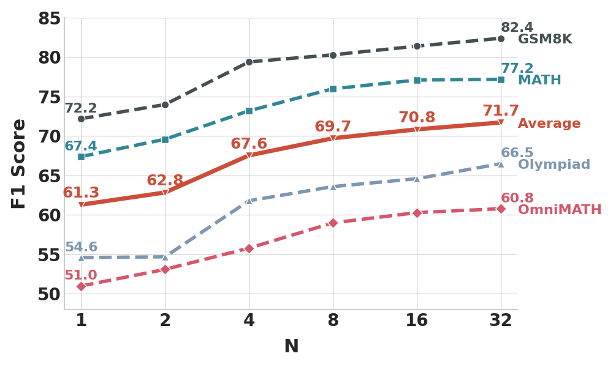

# R-PRM: Reasoning-Driven Process Reward Modeling

<p align="center">
  <a href="https://arxiv.org/abs/2503.21295"> 📃 Paper</a> | 
  <a href="https://shesj-note.notion.site/R-PRM-Reasoning-Driven-Process-Reward-Modeling-9543fb238b0d48338dd44c60999ffd9b"> 📝 Blog</a> | 
  <a href="https://github.com/NJUNLP/R-PRM"> ⚙️ Code</a> | 
  <a href="https://huggingface.co/kevinpro/R-PRM-7B-DPO"> 🤖 Model</a> | 
  <a href="https://huggingface.co/datasets/kevinpro/R-PRM"> 🤗 Dataset</a> | 
  <a href="https://ricardokevins.github.io/"> 📭 Contact</a> 
</p>

## Overview

Welcome to the repository of **R-PRM**, our cutting-edge framework designed to revolutionize process-level evaluation in mathematical reasoning for large language models (LLMs).

* 🚀 We introduce **Reasoning-Driven Process Reward Modeling (R-PRM)**, a novel approach that enhances LLMs' ability to evaluate mathematical reasoning step-by-step. By leveraging stronger LLMs to generate seed data, optimizing preferences without additional annotations, and scaling inference-time computation, R-PRM delivers comprehensive, transparent, and robust assessments of reasoning processes.
* 📈 Our framework significantly boosts evaluation **accuracy** and **generalization**, outperforming strong baselines by wide margins on ProcessBench and PRMBench. When guiding policy models, R-PRM consistently improves reasoning performance across diverse datasets, achieving state-of-the-art (SOTA) results.
* 🌐 Overall, R-PRM offers a scalable and data-efficient solution to the challenge of scarce process-level annotations, enabling a more generalizable enhancement of reasoning evaluation capabilities without extensive human labeling.


## 🏆 Experiment Results

### 🧪 **Data Efficiency**
R-PRM demonstrates exceptional data efficiency under varying training scales:
- With just **12.8k** training samples, R-PRM reaches **F1 = 52.6**, already surpassing most open-source PRMs.
- R-PRM achieves **+3.6** F1 over Qwen2.5-Math-7B-PRM800K when trained on just **64k** samples (vs. Qwen's **265k**), and extends this lead to **+8.7** F1 when both are trained on comparable data volumes.
- Notably, despite using only **~15%** of the data, R-PRM’s performance is already comparable to Qwen2.5-Math-PRM, which was trained on a much larger **1.8M** LLM-filtered dataset.


### 📊 **ProcessBench**
 Our reasoning-driven framework improves over Qwen2.5-Math-7B-PRM800K by **+8.7 F1 (SFT)** and **+13.9 F1 (DPO)**, demonstrating its powerful evaluation capability.

| **Model**         | **GSM8K**        | **MATH**         | **OLYMPIAD**     | **OMNIMATH**     | **Avg. F1**      |
| ----------------------- | ---------------------- | ---------------------- | ---------------------- | ---------------------- | ---------------------- |
| Math-Shepherd-7B        | 47.9                   | 29.5                   | 24.8                   | 23.8                   | 31.5                   |
| Skywork-PRM-7B          | 70.8                   | 53.6                   | 22.9                   | 21.0                   | 42.1                   |
| Qwen2.5-Math-7B-PRM800K | 68.2                   | 62.6                   | 50.7                   | 44.3                   | 56.5                   |
| ⭐ **R-PRM-7B-SFT**         | 77.2 (**+9.0**)  | 71.6 (**+9.0**)  | 59.6 (**+8.9**)  | 52.3 (**+8.0**)  | 65.2 (**+8.7**)  |
| ⭐ **R-PRM-7B-DPO**         | 80.7 (**+12.5**) | 76.9 (**+14.3**) | 63.8 (**+13.1**) | 60.1 (**+15.8**) | 70.4 (**+13.9**) |
| Qwen2.5-Math-PRM-7B     | 82.4                   | 77.6                   | 67.5                   | 66.3                   | 73.5                   |
| GPT-4o                  | 79.2                   | 63.6                   | 51.4                   | 53.5                   | 61.9                   |
| o1-mini                 | 93.2                   | 88.9                   | 87.2                   | 82.4                   | 87.9                   |

### 🧠 **PRMBench**
 R-PRM achieves **+8.5 F1 (DPO)** over Qwen2.5-Math-7B-PRM800K
 📌 Excels in **soundness**, **sensitivity**, and **multi-dimensional error analysis**.


### 🧪 **Best-of-N Strategy**
 When selecting the best among N reasoning paths, R-PRM improves accuracy by **+8.6 points** over the **Pass@1 baseline**, achieving the **best results** among all PRMs across six math datasets.

| **Setting / Model**      | **AIME24** | **AMC23** | **MATH** | **Olympiad** | **College** | **Minerva** | **Avg.** |
| ------------------------------ | ---------------- | --------------- | -------------- | ------------------ | ----------------- | ----------------- | -------------- |
| pass@1 (baseline)    | 11.2             | 47.8            | 73.0           | 38.0               | 38.6              | 37.2              | 41.0           |
| maj@8                | 20.0             | 57.5            | 79.6           | 47.0               | 41.5              | 42.7              | 48.0           |
| pass@8 (upper bound) | 33.3             | 82.5            | 88.8           | 58.5               | 47.5              | 57.7              | 61.4           |
| Math-Shepherd-7B               | 16.7             | 42.5            | 76.0           | 42.0               | 37.0              | 39.3              | 42.3           |
| Skywork-PRM-7B                 | 16.7             | 55.0            | 81.2           | 44.0               | 40.5              | **44.5**    | 47.0           |
| Qwen2.5-Math-7B-PRM800K        | 13.3             | 57.5            | 80.0           | 44.5               | **43.5**    | 43.0              | 47.7           |
| Qwen2.5-Math-PRM-7B            | 16.7             | 55.0            | 82.0           | 48.0               | **43.5**    | 43.0              | **48.0** |
| ⭐ **R-PRM-7B-DPO**                | **20.0**   | **62.5**  | **82.2** | **48.0**     | 41.0              | 44.1              | **49.6** |

### 🔁 **Guide Search Strategy**
 By guiding reasoning step-by-step, R-PRM surpasses Pass@1 by **+8.4 points**, outperforming both **majority voting** and previous PRM-guided methods.

| **Setting / Model**      | **AIME24** | **AMC23** | **MATH** | **Olympiad** | **College** | **Minerva** | **Avg.** |
| ------------------------------ | ---------------- | --------------- | -------------- | ------------------ | ----------------- | ----------------- | -------------- |
| pass@1               | 11.2             | 47.8            | 73.0           | 38.0               | 38.6              | 37.2              | 41.0           |
| major@8              | 20.0             | 57.5            | 79.6           | 47.0               | 41.5              | 42.7              | 48.0           |
| pass@8 (upper bound) | 33.3             | 82.5            | 88.8           | 58.5               | 47.5              | 57.7              | 61.4           |
| Math-Shepherd-7B               | 13.3             | 52.5            | 74.6           | 38.5               | 36.5              | 41.2              | 42.8           |
| Skywork-PRM-7B                 | 10.0             | 57.5            | 77.8           | 41.5               | 39.0              | 43.4              | 44.9           |
| Qwen2.5-Math-7B-PRM800K        | **23.3**   | 45.0            | 78.2           | 42.0               | 35.5              | 38.6              | 43.8           |
| Qwen2.5-Math-PRM-7B            | 16.7             | 60.0            | **81.0** | 43.5               | 39.0              | 40.4              | 46.8           |
| ⭐ **R-PRM-7B-DPO**                | 16.7             | **70.0**  | 80.0           | **46.5**     | 39.5              | **43.4**    | **49.4** |

### 🚀 **Inference-Time Scaling**
 Evaluation performance improves consistently as more reasoning trajectories are sampled at inference.
 → From **62.8 F1 (2 samples)** to **67.6 F1 (4 samples)** on ProcessBench.
 This showcases R-PRM’s ability to deliver **robust, ensemble-style judgment** through multi-path reasoning.



## 🛠️ Training & Evaluation

### 🔧 Training Pipeline

Our training consists of two key stages:

1. **Supervised Fine-Tuning (SFT)** We prompt stronger LLMs with PRM800K samples to construct seed data with detailed step-level analyses and correctness judgments. The model is then trained to generate both reasoning critiques and binary decisions.
2. **Direct Preference Optimization (DPO)** We sample multiple evaluation trajectories and construct preference pairs based on agreement with ground-truth labels. DPO encourages the model to generate consistent and accurate evaluations without requiring additional annotations.

### 📦 Dataset & Scale

- **SFT Training Data**: ~289K samples generated via prompting LLaMA3.3-70B-Instruct
- **DPO Preference Pairs**: ~269K pairs constructed from sampled trajectories
- **Validation Set**: 20K held-out samples for early stopping

### ⚙️ Model & Hyperparameters

- **Base Model**: [Qwen2.5-Math-7B-Instruct](https://huggingface.co/Qwen/Qwen2.5-Math-7B-Instruct)
- **Batch Size**: 128
- **Epochs**: 1
- **Learning Rates**:
  - SFT: `5e-6`
  - DPO: `5e-7`
- **Inference Trajectories**: Default `K=10` per step

### 🧪 Evaluation Protocol

We evaluate the reward model across three main tasks:

- **🔍 ProcessBench**
  Step-level reasoning evaluation with F1 score.
  📄 *Script*: `src/scripts/examples/eval-ProcessBench.sh`
- **🧠 PRMBench**
  Multi-dimensional evaluation across Simplicity, Soundness, and Sensitivity.
  📄 *Script*: `src/scripts/examples/eval-PRMBench.sh`

🔧 You can also use `src/utils/inference.py` to construct the training data (SFT and preference pairs).

## Citation

If you find this repository helpful, feel free to cite our paper:

```
@misc{she2025rprmreasoningdrivenprocessreward,
      title={R-PRM: Reasoning-Driven Process Reward Modeling}, 
      author={Shuaijie She and Junxiao Liu and Yifeng Liu and Jiajun Chen and Xin Huang and Shujian Huang},
      year={2025},
      eprint={2503.21295},
      archivePrefix={arXiv},
      primaryClass={cs.CL},
      url={https://arxiv.org/abs/2503.21295}, 
}
```
